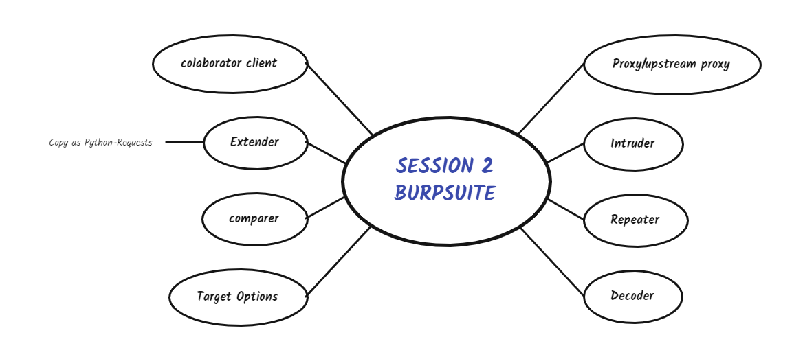

# Burpsuite

 Burpsuite is another great tool or suit for web application tester as it provides us a great features for testing web application. functionalities includes:
 
 1) Proxy / Upstream Proxy
2) Intruder
3) Repeater
4) Decoder
5) Comparer
6) Extender
7) Colaborator Client

Each functionality has its own advantages. 

## Burpsuite Proxy

Its great feature by burp that allows tester to forward all browser activity to burp so other functionalities can utilize the same and no need to manually type those. In the newer version of burpsuite we no longer require to install proxy over browser as burpsuite integreated broswer too. just have to open broswer from burp and good to go.

### Burpsuite Proxy History

Burpsuite has great logging system or functionality in which stores all proxy logs or request logs on local DB. logs can be utilized to check pas activity and requests. Its handy feature to keep eys over all Backgroup functionality.

## BurpSuite Repeater.

Repeater Functionality allows tester to test each and every functionality and parameters designed. Testing will be manual one which allows tester to manually add payloads in order to identify vulnerability. Tester can use it to manually test web application by targeting single vulnerability at a time.

## BurpSuite Intruder

Intruder allows tester to fuzz web functionalities and parameters. Fuzzing web is a great way to black box aproch to find web vulnerbilities.

##### What is fuzzing ??

Its process where a parameter or functinality will recive unexpected data which can be leads to crash or causing unwanted behaviour on server response. response behaviour can be changed like.

1) Delay
2) No response
3) Errors

Intruder allows to specify the target scope to be fuzzed and payload list to toggle with that scope.

For this course we won't be using it as we have targeted white box testing and fuzzing is not part of the same.

## BurpSuite Decoder

Its another great and simple feature which burpsuit provides, that allows tester to encode/decode diffrent data like URL/BASE64 and more. this functionality allows tester to encode and decode data by just using shortcuts or it can be used as standalone too. this feature really helps to encode and decode most used formats like URL encode by just using shortcut as `CTRL + U` for encoding and `CTRL+SHIFT+U` for decoding.

## Burpsuit Comparer.

Comparer allows to compare 2 diffrent requests or response. this feature is handy when response changes very short and you want all reponse change information. you can simply compare those response and this feature highlights diffrent changes with colors.

## Burpsuite Extender.

Its another feature which makes burpSuite as Suite as it limitless extends features of burp and allows intigration of other functionalities. tester can write their own extension using burp API and it will allows more features and control over burp. burp has app-store from which tester can download others extensions which are published.

#### Extension which helps.

Burp Extensions are really helpful sometimes, for our specific task to copy request we will be using an extension  named copy as python request. there are alternative for powershell or Node.JS

#### Colaborator Client

Burp Colaborator Client allows tester to have callback addresses or a server like responder which has many services running. it basically provides Subdomains which can be used to find vulnerabiities which are blind and can't be found with response changes. 
ie.
1) blind XSS
2) Blind SQL
3) Bllind XXE
4) SSRF

there are more but basically its really handy feature to identify such vulnerabilites.
